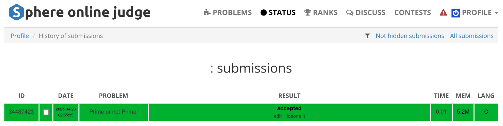

# Horrible Problem

## Analisis Soal

### Deskripsi Permainan

Dalam permainan ini:
1. Ada $N$ pin bowling yang ditempatkan dalam satu baris.
2. Alice dan Bob bergantian mengambil minimal 1 dan maksimal 2 pin, dengan syarat tidak ada celah atau pin lain di antara kedua pin tersebut.
3. Pemenang adalah pemain yang melakukan gerakan terakhir.
4. Alice melakukan gerakan pertama.
5. Kedua pemain bermain secara optimal.

## Penjelasan Langkah Penyelesaian

Karena Alice selalu menang, maka penjelasan akan berupa [proof](#proof).

## Proof

### Bukti 1: Pembuktian Langsung

Alice selalu bisa menang untuk semua $N \geq 1$.

**Basis Kasus:**
- Untuk $N = 1$: Alice mengambil satu-satunya pin dan langsung menang.
- Untuk $N = 2$: Alice mengambil kedua pin sekaligus dan langsung menang.

**Langkah Induktif:**
Asumsikan Alice dapat menang untuk semua permainan dengan jumlah pin $k$ di mana $1 \leq k < N$ dan $N \geq 3$.

Sekarang, untuk permainan dengan $N$ pin, Alice dapat menggunakan strategi berikut:
1. Jika $N$ ganjil, Alice mengambil pin tengah (posisi $\lceil\frac{N}{2}\rceil$). Ini membagi permainan menjadi dua permainan terpisah dengan jumlah pin yang sama, yaitu $\frac{N-1}{2}$ pin di setiap sisi.
2. Jika $N$ genap, Alice mengambil dua pin tengah (posisi $\frac{N}{2}$ dan $\frac{N}{2}+1$). Ini membagi permainan menjadi dua permainan terpisah dengan jumlah pin yang sama, yaitu $\frac{N-2}{2}$ pin di setiap sisi.

Setelah gerakan Alice, permainan terbagi menjadi dua permainan independen. Ketika Bob mengambil pin dari salah satu sisi, Alice dapat membalas dengan mengambil pin dari sisi yang sama. Dengan strategi ini, untuk setiap gerakan Bob, Alice memiliki gerakan balasan yang valid.

Karena jumlah total gerakan harus berhingga (maksimal $N$ gerakan), dan Alice selalu dapat melakukan gerakan balasan untuk setiap gerakan Bob, maka pasti Alice yang akan melakukan gerakan terakhir. Oleh karena itu, Alice selalu menang.

### Bukti 2: Pembuktian dengan Kontradiksi

**Asumsi Kontradiksi:** Asumsikan ada $N \geq 1$ di mana Bob bisa menang dengan permainan optimal.

Jika Bob menang, berarti ada strategi di mana Bob melakukan gerakan terakhir. Karena setiap pemain mengambil minimal 1 pin pada setiap giliran, permainan akan berakhir dalam maksimal $N$ gerakan. Karena Alice bergerak terlebih dahulu, dan jumlah total gerakan adalah maksimal $N$, maka:

- Jika $N$ ganjil, pemain pertama (Alice) akan melakukan gerakan terakhir.
- Jika $N$ genap, pemain kedua (Bob) akan melakukan gerakan terakhir.

Jadi, Bob hanya bisa menang jika $N$ genap. Mari kita tinjau kasus $N$ genap.

Untuk $N = 2$, Alice dapat mengambil kedua pin sekaligus pada gerakan pertama dan langsung menang. Jadi, Bob tidak bisa menang untuk $N = 2$.

Untuk $N \geq 4$ dan genap, Alice dapat mengambil dua pin tengah pada gerakan pertama. Ini membagi permainan menjadi dua permainan terpisah dengan jumlah pin yang sama, yaitu $\frac{N-2}{2}$ di setiap sisi. Setelah itu, untuk setiap gerakan Bob di salah satu sisi, Alice dapat membalas dengan mengambil pin dari sisi yang sama.

Dengan strategi ini, ketika Bob mengambil pin terakhir di salah satu sisi, Alice akan mengambil pin terakhir di sisi lainnya. Karena jumlah pin di kedua sisi sama, maka Alice pasti akan melakukan gerakan terakhir.

Ini berkontradiksi dengan asumsi kita bahwa Bob bisa menang. Oleh karena itu, asumsi kita salah, dan Alice selalu menang untuk semua $N \geq 1$.

### Kesimpulan

Dari kedua metode pembuktian di atas, kita dapat menyimpulkan bahwa Alice selalu menang dalam permainan ini untuk semua $N \geq 1$ jika kedua pemain bermain secara optimal.

## Verdict


# Prime or Not Prime

## Analisis Soal

Diberikan $T$ jumlah angka $1 \leq N \leq 10^9$, cek apakah angka tersebut prima.

## Penjelasan Langkah Penyelesaian

### Komponen Utama

Algoritma ini terdiri dari dua fungsi utama:

1. Fungsi `sieve`: Membuat array bilangan prima hingga batas tertentu
2. Fungsi `is_prime`: Memeriksa apakah sebuah bilangan adalah prima

### Fungsi `sieve`

Fungsi ini mengimplementasikan *Sieve of Eratosthenes* yang dioptimasi:

```c
void sieve(ull limit, ull **primes, ull *prime_count) {
    if (limit < 2) {
        *primes = NULL;
        *prime_count = 0;
        return;
    }

    ull sieve_size = (limit + 1) / 2;
    char *sieve = (char*)malloc((sieve_size + 7) / 8);
    memset(sieve, 0xFF, (sieve_size + 7) / 8);

    sieve[0] &= ~(1 << 0); // 1 is not prime

    for (ull i = 1; i <= (ull)(sqrt(limit)) / 2; ++i) {
        if (sieve[i >> 3] & (1 << (i & 7))) {
            ull prime = 2 * i + 1;
            for (ull j = i + prime; j < sieve_size; j += prime) sieve [j >> 3] &= ~(1 << (j &7));
        }
    }
    
    *prime_count = (limit >= 2) ? 1 : 0;
    for (ull i = 1; i < sieve_size; ++i) {
        if (sieve[i >> 3] & (1 << (i & 7))) (*prime_count)++;
    }

    *primes = malloc(*prime_count * sizeof(ull));
    ull index = 0;
    if (limit >= 2) (*primes)[index++] = 2;
    for (ull i = 1; i < sieve_size; ++i) {
        if (sieve[i >> 3] & (1 << (i & 7))) (*primes)[index++] = 2 * i + 1;
    }

    free(sieve);
}
```

#### Penjelasan Fungsi `sieve`:

1. **Optimasi Ruang**: Fungsi ini menggunakan teknik bit-packing untuk menghemat memori. Fungsi ini hanya menyimpan informasi bilangan ganjil (karena semua bilangan genap kecuali 2 bukan prima).

2. **Inisialisasi sieve**:
   - Alokasikan memori untuk sieve dengan ukuran `(limit + 1) / 2` (hanya untuk bilangan ganjil) 
   - Menggunakan bit-packing sehingga ukuran sebenarnya adalah `(sieve_size + 7) / 8` byte
   - Setiap bit dalam byte merepresentasikan satu bilangan ganjil

3. **Pengaturan Bit**:
   - Setiap bit diatur ke 1 (menggunakan `memset(sieve, 0xFF, ...)`)
   - Bit 0 (mewakili angka 1) diatur ke 0 karena 1 bukan prima

4. **Algoritma sieve**:
   - Iterasi dari 1 hingga sqrt(limit)/2, yang merepresentasikan bilangan ganjil hingga sqrt(limit)
   - Untuk setiap bilangan prima p = 2i+1, hapus semua kelipatan p dimulai dari p²
   - Operasi `i >> 3` membagi i dengan 8 untuk mendapatkan indeks byte
   - Operasi `i & 7` mengambil i modulo 8 untuk mendapatkan posisi bit dalam byte

5. **Pengumpulan Hasil**:
   - Hitung jumlah bilangan prima (`prime_count`)
   - Alokasikan array untuk menyimpan bilangan prima
   - Tambahkan 2 jika limit >= 2
   - Iterasi semua bilangan ganjil dan tambahkan yang masih ditandai sebagai prima

### Fungsi `is_prime`

Fungsi ini memeriksa apakah sebuah bilangan adalah prima:

```c
int is_prime(ull n) {
    if (n <= 1) return 0;
    if (n == 2) return 1;
    if (n % 2 == 0) return 0;

    ull sqrt_n = (ull)sqrt(n);
    ull *base_primes;
    ull base_count;

    sieve(sqrt_n, &base_primes, &base_count);
    
    for (ull i = 0; i < base_count; ++i) {
        if (n % base_primes[i] == 0) {
            free(base_primes);
            return 0;
        }
    }

    free(base_primes);
    return 1;
}
```

#### Penjelasan Fungsi `is_prime`:

1. **Pengecekan Kasus Dasar**:
   - Mengembalikan 0 jika n ≤ 1 (bukan prima)
   - Mengembalikan 1 jika n = 2 (prima)
   - Mengembalikan 0 jika n adalah bilangan genap > 2 (bukan prima)

2. **Optimasi Pencarian**:
   - Kita hanya perlu memeriksa pembagi hingga sqrt(n)
   - Menggunakan fungsi `sieve` untuk menghasilkan semua bilangan prima hingga sqrt(n)

3. **Pengujian Bilangan Prima**:
   - Periksa apakah n habis dibagi oleh bilangan prima apa pun hingga sqrt(n)
   - Jika ya, n bukan prima
   - Jika tidak ada bilangan prima yang habis membagi n, maka n adalah bilangan prima

### Fungsi `main`

Fungsi main membaca jumlah kasus uji dan untuk setiap kasus memeriksa apakah bilangan yang diberikan adalah prima:

```c
int main() {
    ull n;
    scanf("%llu", &n);

    for (int i = 0; i < n; i++) {
        ull x;
        scanf("%llu", &x);
        printf(is_prime(x) ? "YES\n" : "NO\n");
    }

    return 0;
}
```

## Proof

### Metode 1: Direct Proof

#### Implementasi Sieve (sieve)

Algoritma ini mengimplementasikan sieve Eratosthenes dengan optimasi bit-packing. Ide utamanya adalah hanya menyimpan bilangan ganjil dalam sieve, sehingga mengurangi setengah kebutuhan ruang.

**Teorema 1:** Fungsi `sieve` dengan benar mengidentifikasi semua bilangan prima hingga batas tertentu.

**Bukti:**
1. Fungsi ini menginisialisasi dengan menandai 1 sebagai bukan prima (benar berdasarkan definisi).
2. Fungsi hanya mempertimbangkan bilangan ganjil (karena semua bilangan genap kecuali 2 adalah komposit).
3. Untuk setiap bilangan ganjil $p = 2i+1$ (di mana $i \geq 1$):
   - Jika $p$ ditandai sebagai prima, fungsi mengeliminasi semua kelipatan $p$ dimulai dari $p^2$ 
   - Ini secara matematis benar karena setiap kelipatan $p$ yang kurang dari $p^2$ seharusnya sudah dieliminasi oleh faktor prima yang lebih kecil.
4. Loop luar berjalan hingga $\sqrt{\text{limit}}$ karena setiap bilangan komposit $n$ memiliki setidaknya satu faktor prima $p \leq \sqrt{n}$.

Ini mengikuti langsung dari teorema dasar dalam teori bilangan: setiap bilangan komposit $n$ memiliki faktor prima $p \leq \sqrt{n}$.

**Bukti teorema ini:**
Misalkan $n$ adalah bilangan komposit. Jika semua faktor primanya lebih besar dari $\sqrt{n}$, maka hasil kali dari dua faktor apapun akan melebihi $n$, yang bertentangan dengan fakta bahwa $n$ adalah hasil kali mereka. Oleh karena itu, $n$ harus memiliki setidaknya satu faktor prima $p \leq \sqrt{n}$.

#### Fungsi Pengecekan Prima
Fungsi `is_prime` menggunakan pendekatan berikut:
1. Menangani kasus dasar: bilangan $\leq 1$ bukan prima, 2 adalah prima, bilangan genap $> 2$ bukan prima.
2. Untuk bilangan ganjil $> 2$, periksa keterbagian oleh semua bilangan prima hingga $\sqrt{n}$.

**Teorema 2:** Fungsi `is_prime` dengan benar menentukan apakah suatu bilangan $n$ adalah prima.

**Bukti:**
1. Suatu bilangan $n > 1$ adalah prima jika dan hanya jika tidak memiliki pembagi positif selain 1 dan dirinya sendiri.
2. Jika $n$ memiliki pembagi non-trivial, maka ia memiliki pembagi prima $p \leq \sqrt{n}$ (sebagaimana dibuktikan di atas).
3. Fungsi memeriksa keterbagian oleh semua bilangan prima hingga $\sqrt{n}$.
4. Jika tidak ada yang membagi $n$, maka $n$ tidak memiliki pembagi prima, yang berarti $n$ tidak memiliki pembagi non-trivial, menjadikannya prima.

### Metode 2: Proof by Contradiction

#### Kebenaran Pengujian Bilangan Prima

**Teorema:** Fungsi `is_prime` dengan benar mengidentifikasi apakah suatu bilangan $n$ adalah prima.

**Pembuktian dengan Kontradiksi:**

Asumsikan fungsi ini salah mengklasifikasikan bilangan $n$. Ada dua kemungkinan kasus:

##### Kasus 1: Fungsi mengklasifikasikan bilangan komposit $n$ sebagai prima.

Misalkan $n$ adalah komposit tetapi `is_prime(n)` mengembalikan true.

1. Karena $n$ adalah komposit, ada bilangan bulat $a$ dan $b$ sedemikian sehingga $n = a \times b$ di mana $1 < a, b < n$.
2. Di antara $a$ dan $b$, setidaknya satu faktor harus $\leq \sqrt{n}$ (jika keduanya $> \sqrt{n}$, hasil kali mereka akan melebihi $n$).
3. Mari kita sebut faktor yang lebih kecil $p$. Jika $p$ bukan prima, maka harus memiliki faktor prima $p' < p$.
4. Oleh karena itu, $n$ memiliki setidaknya satu faktor prima $p^* \leq \sqrt{n}$.
5. Algoritma menguji keterbagian $n$ oleh semua bilangan prima hingga $\sqrt{n}$.
6. Jika $n$ memiliki faktor prima $p^* \leq \sqrt{n}$, algoritma akan mendeteksi bahwa $n \bmod p^* = 0$.
7. Ini akan menyebabkan fungsi mengembalikan false, bertentangan dengan asumsi kita.

Oleh karena itu, fungsi tidak dapat mengklasifikasikan bilangan komposit sebagai prima.

##### Kasus 2: Fungsi mengklasifikasikan bilangan prima $n$ sebagai komposit.

Misalkan $n$ adalah prima tetapi `is_prime(n)` mengembalikan false.

1. Agar ini terjadi, fungsi harus menemukan nilai $p$ dalam `base_primes` sedemikian sehingga $n \bmod p = 0$.
2. Ini berarti $p$ adalah pembagi dari $n$ di mana $1 < p < n$.
3. Tetapi ini bertentangan dengan definisi bilangan prima, yang tidak memiliki pembagi selain 1 dan dirinya sendiri.

Oleh karena itu, fungsi tidak dapat mengklasifikasikan bilangan prima sebagai komposit.

#### Kebenaran Implementasi Sieve

**Teorema:** Sieve dengan benar mengidentifikasi semua bilangan prima hingga batas.

**Pembuktian dengan Kontradiksi:**

Asumsikan ada bilangan $q$ dalam rentang $[2, \text{limit}]$ yang salah diklasifikasikan.

##### Kasus 1: $q$ adalah prima tetapi tidak dalam array primes.

1. Jika $q = 2$, kode secara eksplisit memasukkannya ketika $\text{limit} \geq 2$.
2. Jika $q > 2$, maka $q$ harus ganjil (karena semua bilangan genap $> 2$ adalah komposit).
3. Untuk bilangan prima ganjil $q = 2i+1$, ia akan direpresentasikan oleh posisi bit $i$ dalam sieve.
4. Agar $q$ tidak termasuk, bitnya harus telah dihapus selama proses sieve.
5. Ini hanya akan terjadi jika $q$ adalah kelipatan dari beberapa bilangan prima yang lebih kecil $p$.
6. Tetapi ini bertentangan dengan $q$ yang merupakan bilangan prima.

##### Kasus 2: $q$ adalah komposit tetapi termasuk dalam array primes.

1. Jika $q$ adalah genap dan bukan 2, ia tidak pernah dimasukkan dalam array primes.
2. Jika $q$ adalah ganjil dan komposit, maka $q = p \times m$ untuk beberapa bilangan prima $p \leq \sqrt{q}$ dan bilangan bulat $m > 1$.
3. Selama proses sieve, ketika $p$ diproses, semua kelipatannya termasuk $q$ akan ditandai sebagai komposit.
4. Agar $q$ dimasukkan dalam array primes, bitnya harus tetap diatur.
5. Tetapi ini bertentangan dengan algoritma sieve, yang secara eksplisit menghapus bit untuk semua kelipatan dari bilangan prima.

Oleh karena itu, asumsi kita harus salah, dan sieve dengan benar mengidentifikasi semua bilangan prima hingga batas.

#### Kebenaran Operasi Bit

**Teorema:** Operasi manipulasi bit dengan benar mengimplementasikan logika sieve.

**Pembuktian dengan Kontradiksi:**

Asumsikan operasi bit gagal merepresentasikan keadaan sieve dengan benar.

1. Untuk bilangan ganjil $2i+1$, keadaannya disimpan dalam byte `i>>3` pada posisi bit `i&7`.
2. Jika pemetaan itu salah, akan ada tabrakan di mana dua bilangan berbeda dipetakan ke bit yang sama.
3. Tetapi pemetaan ini injektif: setiap $i$ dipetakan ke tepat satu pasangan (byte, bit).
4. Oleh karena itu, operasi bit dengan benar mengimplementasikan logika sieve.

Melalui kontradiksi-kontradiksi ini, kita telah membuktikan bahwa baik implementasi sieve maupun fungsi pengujian bilangan prima adalah benar.

## Verdict
